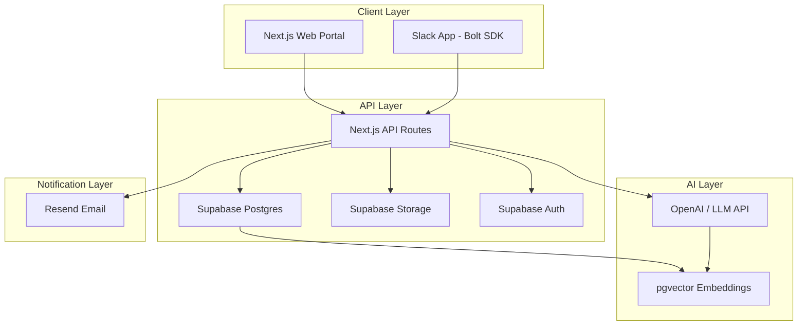
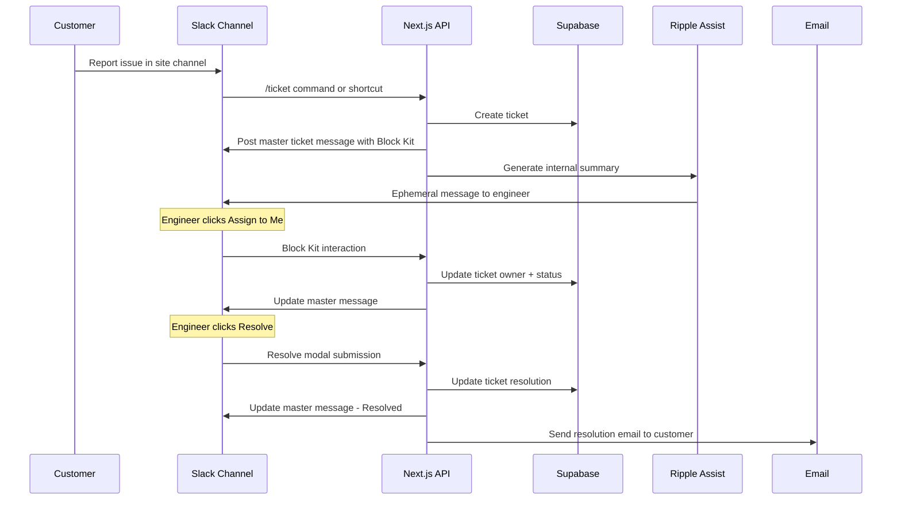
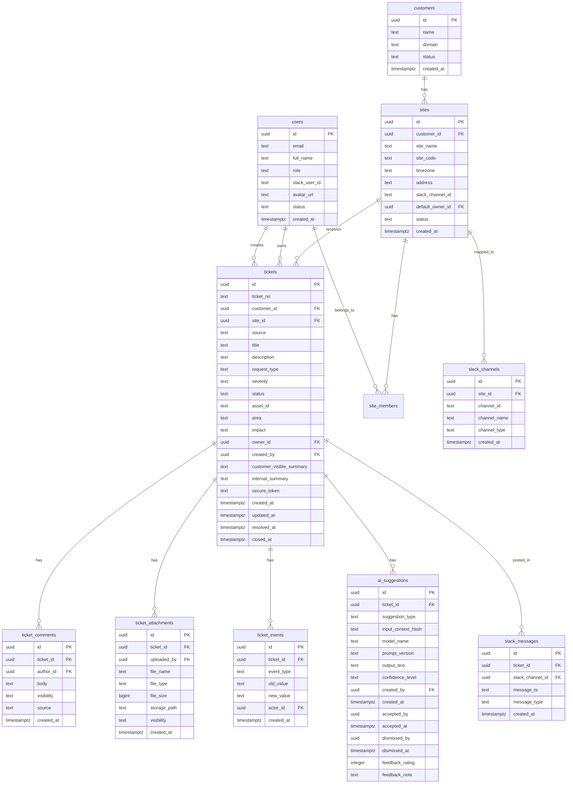
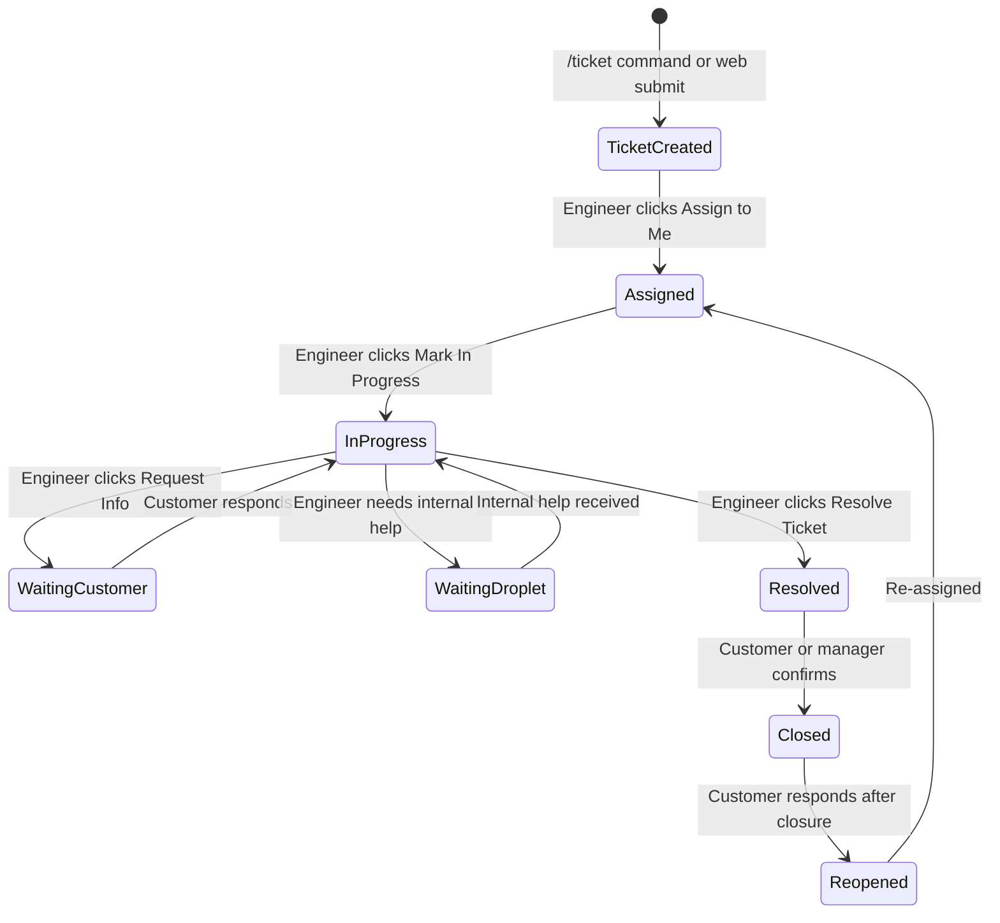
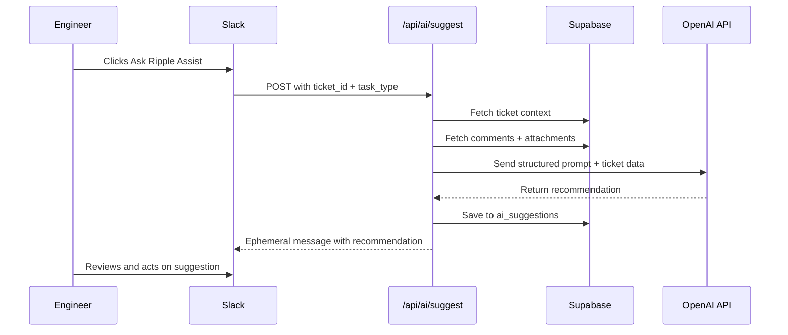

# Ripple — Architecture & Implementation Plan

## 1. Project Overview

Ripple is a lightweight Slack-native support tool for DropletAI Services. It centralizes all customer support requests across industrial automation sites (AMR, AGV, conveyors, sortation, RCS/WCS) into a unified Supabase-backed ticket system, operated primarily through Slack with a Next.js web portal for customer submission and internal administration.

---

## 2. High-Level Architecture



### Data Flow



---

## 3. Tech Stack

| Layer | Tool | Notes |
|-------|------|-------|
| Frontend | Next.js 15+ App Router | TypeScript, Tailwind CSS |
| UI Components | shadcn/ui | Consistent with DropletAI design |
| Hosting | Vercel | Serverless functions for API |
| Database | Supabase Postgres | Source of truth |
| Auth | Supabase Auth | Magic link for customers, internal SSO later |
| Storage | Supabase Storage | Attachments, logos |
| Slack App | Slack Bolt for Node.js | Via Next.js API routes |
| Email | Resend | Transactional emails |
| AI | OpenAI API | Ripple Assist recommendations |
| Vector Search | Supabase pgvector | Similar ticket search |
| Styling | Tailwind CSS | White / dark gray / blue accent |

---

## 4. Project Structure

```
ripple/
├── src/
│   ├── app/
│   │   ├── layout.tsx                    # Root layout
│   │   ├── page.tsx                      # Landing page
│   │   ├── (public)/                     # Public route group
│   │   │   ├── submit/
│   │   │   │   └── page.tsx              # Customer ticket submission
│   │   │   └── t/
│   │   │       └── [ticketId]/
│   │   │           └── page.tsx          # Secure ticket view
│   │   ├── (auth)/                       # Authenticated route group
│   │   │   ├── layout.tsx                # Auth layout with sidebar
│   │   │   ├── dashboard/
│   │   │   │   └── page.tsx              # Admin dashboard
│   │   │   ├── tickets/
│   │   │   │   ├── page.tsx              # Ticket list
│   │   │   │   └── [ticketId]/
│   │   │   │       └── page.tsx          # Ticket detail
│   │   │   ├── customers/
│   │   │   │   ├── page.tsx              # Customer list
│   │   │   │   └── [customerId]/
│   │   │   │       └── page.tsx          # Customer detail + sites
│   │   │   └── settings/
│   │   │       └── page.tsx              # System settings
│   │   └── api/
│   │       ├── slack/
│   │       │   ├── events/route.ts       # Slack Event Subscriptions
│   │       │   ├── interactive/route.ts  # Block Kit interactions
│   │       │   └── command/
│   │       │       └── ticket/route.ts   # /ticket slash command
│   │       ├── tickets/
│   │       │   ├── route.ts              # GET list, POST create
│   │       │   └── [ticketId]/
│   │       │       ├── route.ts          # GET, PATCH ticket
│   │       │       ├── comments/route.ts # Comments CRUD
│   │       │       └── attachments/route.ts
│   │       ├── customers/route.ts
│   │       ├── sites/route.ts
│   │       ├── upload/route.ts           # File upload to Supabase Storage
│   │       └── ai/
│   │           └── suggest/route.ts      # Ripple Assist endpoint
│   ├── components/
│   │   ├── ui/                           # shadcn/ui base components
│   │   ├── tickets/                      # Ticket cards, forms, status badges
│   │   ├── forms/                        # Reusable form components
│   │   └── layout/                       # Sidebar, header, nav
│   ├── lib/
│   │   ├── supabase/
│   │   │   ├── client.ts                # Browser Supabase client
│   │   │   ├── server.ts                # Server-side Supabase client
│   │   │   └── admin.ts                 # Service role client
│   │   ├── slack/
│   │   │   ├── app.ts                   # Slack Bolt app instance
│   │   │   ├── blocks/
│   │   │   │   ├── ticket-master.ts     # Master ticket Block Kit message
│   │   │   │   ├── ticket-form.ts       # Ticket creation modal
│   │   │   │   ├── resolve-modal.ts     # Resolution modal
│   │   │   │   └── ai-modal.ts          # Ask Ripple Assist modal
│   │   │   └── handlers/
│   │   │       ├── commands.ts          # Slash command handlers
│   │   │       ├── actions.ts           # Block Kit action handlers
│   │   │       └── events.ts            # Event handlers
│   │   ├── ai/
│   │   │   ├── prompt.ts                # System prompts
│   │   │   ├── suggest.ts               # AI suggestion generation
│   │   │   └── embeddings.ts            # Vector embedding utils
│   │   ├── email/
│   │   │   └── send.ts                  # Resend email templates
│   │   └── utils.ts                     # Shared utilities
│   ├── types/
│   │   ├── database.ts                  # Supabase generated types
│   │   ├── ticket.ts                    # Ticket domain types
│   │   └── slack.ts                     # Slack-related types
│   └── styles/
│       └── globals.css
├── supabase/
│   ├── config.toml
│   └── migrations/
│       ├── 001_create_customers.sql
│       ├── 002_create_sites.sql
│       ├── 003_create_users_and_roles.sql
│       ├── 004_create_tickets.sql
│       ├── 005_create_ticket_comments.sql
│       ├── 006_create_ticket_attachments.sql
│       ├── 007_create_ticket_events.sql
│       ├── 008_create_slack_integrations.sql
│       ├── 009_create_ai_tables.sql
│       ├── 010_create_rls_policies.sql
│       └── 011_create_functions_and_triggers.sql
├── public/
│   └── logo.svg
├── plans/
├── .env.local.example
├── next.config.ts
├── tailwind.config.ts
├── tsconfig.json
├── package.json
└── README.md
```

---

## 5. Database Schema Design

### 5.1 Entity Relationship Diagram



### 5.2 Enum / Constraint Definitions

```
-- Ticket source
CHECK source IN ('slack', 'web', 'email', 'internal')

-- Request type
CHECK request_type IN ('incident', 'service_request', 'question', 'change_request', 'parts_rma', 'deployment_issue', 'training_documentation')

-- Severity
CHECK severity IN ('P1', 'P2', 'P3', 'P4')

-- Status
CHECK status IN ('new', 'assigned', 'in_progress', 'waiting_customer', 'waiting_droplet', 'resolved', 'closed', 'reopened')

-- Impact
CHECK impact IN ('safety', 'production_stopped', 'production_slowed', 'single_asset', 'no_impact')

-- Comment visibility
CHECK visibility IN ('customer', 'internal')

-- User role
CHECK role IN ('internal_admin', 'internal_service_manager', 'internal_engineer', 'internal_solution_engineer', 'customer_admin', 'customer_user', 'guest')
```

### 5.3 Key Database Functions

- `generate_ticket_no()` — Auto-increment RPL-000001 format
- `update_ticket_updated_at()` — Trigger on any ticket change
- `create_ticket_event()` — Trigger to log status/owner/severity changes
- `match_site_by_code(site_code TEXT)` — Lookup site from code

---

## 6. Slack Integration Architecture

### 6.1 Slack Bolt via Next.js API Routes

Slack Bolt will run within Next.js API route handlers. This avoids a separate long-running process and works natively with Vercel serverless functions.

```mermaid
graph LR
    SL[Slack API] -->|POST| EV[/api/slack/events]
    SL -->|POST| CMD[/api/slack/command/ticket]
    SL -->|POST| INT[/api/slack/interactive]
    
    EV --> SB[Slack Bolt - eventHandler]
    CMD --> SB2[Slack Bolt - commandHandler]
    INT --> SB3[Slack Bolt - actionHandler]
    
    SB --> DB[Supabase]
    SB2 --> DB
    SB3 --> DB
```

### 6.2 Slack App Scopes Required

```
commands          # /ticket slash command
chat:write        # Post messages
chat:write.public # Post to any channel
channels:read     # Read channel info
groups:read       # Read private channels
users:read        # Read user profiles
users.profile:read
files:read        # Read shared files
files:write       # Upload files
reactions:write   # Add emoji reactions
pins:write        # Pin messages
```

### 6.3 Master Ticket Message Block Kit Structure

The master message uses Slack Block Kit with action buttons:

```
[HEADER] RPL-000128 · P2 · AMR not completing delivery mission
[DIVIDER]
[SECTION] Customer: Adidas | Site: INDY
[SECTION] Status: In Progress | Owner: Nathan
[SECTION] Asset: AMR-03 | Area: Screen Print / Line-side
[SECTION] Impact: Production slowed down
[CONTEXT] Created: 2026-05-19 10:35 ET | Updated: Waiting for photo
[DIVIDER]
[ACTIONS]
  [Assign to Me] [In Progress] [Request Info] [Customer Update] [Resolve] [Ask Ripple Assist]
```

### 6.4 Slack Interaction Flow



---

## 7. Web Portal Architecture

### 7.1 Route Structure

| Route | Type | Auth | Description |
|-------|------|------|-------------|
| `/` | Public | No | Landing page with links |
| `/submit` | Public | No | Customer ticket submission form |
| `/t/[ticketId]` | Public* | Token | Secure ticket view via token |
| `/dashboard` | Protected | Yes | Admin dashboard |
| `/tickets` | Protected | Yes | Ticket list with filters |
| `/tickets/[id]` | Protected | Yes | Ticket detail view |
| `/customers` | Protected | Yes | Customer management |
| `/customers/[id]` | Protected | Yes | Customer detail + sites |
| `/settings` | Protected | Yes | System settings |

*Public but requires secure token in URL query param

### 7.2 Design System

Following DropletAI brand guidelines:
- **Primary colors**: White `#FFFFFF`, Dark gray `#1A1A2E`, Blue accent `#0EA5E9`
- **Typography**: Inter or similar clean sans-serif
- **Components**: shadcn/ui with custom DropletAI theme
- **Layout**: Clean, industrial-tech aesthetic, spacious

---

## 8. Ripple Assist AI Architecture

### 8.1 Phase 1 — Manual AI Assist



### 8.2 AI Safety Boundaries

- All AI output is `visibility: internal` by default
- AI never posts to shared customer channels
- AI uses ephemeral Slack messages visible only to the requesting engineer
- Customer-uploaded content is treated as untrusted input
- System prompt is never exposed in output
- Confidence level is always displayed

---

## 9. Notification System

### 9.1 Slack Notifications

| Event | Target | Priority |
|-------|--------|----------|
| New P1 ticket | Site channel + internal owner DM | Immediate |
| New P2/P3 ticket | Site channel | Immediate |
| Ticket assigned | Thread reply | Normal |
| Status change | Master message update | Normal |
| Ticket resolved | Site channel thread + email | Normal |
| Ticket reopened | Site channel + owner DM | Immediate |

### 9.2 Email Notifications via Resend

| Event | Recipient | Template |
|-------|-----------|----------|
| Web ticket submitted | Submitter | Confirmation with ticket ID + secure link |
| Ticket resolved | Submitter | Resolution summary |
| Ticket closed | Submitter | Closure confirmation |

---

## 10. Security & Permissions

### 10.1 Row Level Security

- Customer users can only see tickets for their own sites
- Internal users see tickets based on their role and assigned sites
- `internal_notes` visibility comments are filtered for customer-facing queries
- Secure ticket tokens are cryptographically random, 32+ characters

### 10.2 API Security

- Slack requests verified via signing secret
- Web API uses Supabase Auth JWT for protected routes
- Public submission endpoint has rate limiting
- File upload has type and size validation

---

## 11. Environment Variables

```env
# Supabase
NEXT_PUBLIC_SUPABASE_URL=
NEXT_PUBLIC_SUPABASE_ANON_KEY=
SUPABASE_SERVICE_ROLE_KEY=

# Slack
SLACK_BOT_TOKEN=
SLACK_SIGNING_SECRET=
SLACK_APP_TOKEN=

# AI
OPENAI_API_KEY=

# Email
RESEND_API_KEY=
EMAIL_FROM=support@dropletai.services

# App
NEXT_PUBLIC_APP_URL=https://support.dropletai.services
```

---

## 12. Implementation Phases

### Phase 1 — Project Foundation
- Initialize Next.js 15 project with TypeScript and Tailwind CSS
- Install and configure shadcn/ui
- Set up Supabase client libraries
- Create `.env.local.example` with all required variables
- Set up project structure as defined in Section 4

### Phase 2 — Database Schema
- Create all Supabase migrations in order
- Set up RLS policies for each table
- Create database functions and triggers
- Generate TypeScript types from Supabase schema
- Seed script for development data

### Phase 3 — Slack App Foundation
- Create Slack app configuration in Slack API dashboard
- Implement Slack Bolt integration via API routes
- Set up event URL verification endpoint
- Implement `/ticket` slash command handler
- Test with Slack development workspace

### Phase 4 — Slack Ticket Workflow
- Build ticket creation modal form
- Implement master ticket message Block Kit builder
- Build Assign to Me action handler
- Build status change action handlers
- Build resolve ticket modal with required fields
- Implement thread comment capture
- Implement master message update on status change

### Phase 5 — Web Portal Public Pages
- Build customer ticket submission form
- Implement site code lookup and routing
- Implement file upload to Supabase Storage
- Build email confirmation with Resend
- Trigger Slack notification on web ticket creation

### Phase 6 — Secure Ticket View
- Build secure token generation on ticket creation
- Build public ticket view page with token auth
- Add customer comment form
- Display status timeline and attachments

### Phase 7 — Internal Admin Dashboard
- Build authenticated layout with sidebar navigation
- Build dashboard page with key metrics
- Build ticket list with filters and search
- Build ticket detail page with full context
- Build customer and site management CRUD
- Implement CSV export

### Phase 8 — Ripple Assist Phase 1
- Build Ask Ripple Assist modal in Slack
- Create AI prompt templates
- Implement `/api/ai/suggest` endpoint
- Build ephemeral Slack message response
- Save suggestions to `ai_suggestions` table
- Add feedback buttons: Mark Helpful / Not Helpful

### Phase 9 — Notification System
- Implement Slack notification rules
- Build email templates for Resend
- Set up notification triggers on ticket events

### Phase 10 — Testing, Deployment & Documentation
- Write README with setup instructions
- Deploy to Vercel
- Configure custom domain
- Production Slack app configuration
- Environment variable setup

---

## 13. Key Dependencies

```json
{
  "dependencies": {
    "next": "^15.0.0",
    "react": "^19.0.0",
    "react-dom": "^19.0.0",
    "@supabase/supabase-js": "^2.0.0",
    "@supabase/ssr": "^0.5.0",
    "@slack/bolt": "^4.0.0",
    "@slack/web-api": "^7.0.0",
    "openai": "^4.0.0",
    "resend": "^4.0.0",
    "zod": "^3.0.0",
    "tailwindcss": "^4.0.0",
    "lucide-react": "^0.400.0"
  },
  "devDependencies": {
    "typescript": "^5.0.0",
    "supabase": "^1.0.0",
    "@types/node": "^22.0.0"
  }
}
```

---

## 14. Design Mockup Notes

### Submit Ticket Page Layout
```
┌─────────────────────────────────────────┐
│  [DropletAI Logo]  Ripple Support       │
├─────────────────────────────────────────┤
│                                         │
│  Submit a Support Request               │
│                                         │
│  Company *          [Select...]         │
│  Site Code *        [e.g. ADI-INDY-001] │
│  Your Name *        [____________]      │
│  Email *            [____________]      │
│  Phone              [____________]      │
│                                         │
│  Issue Title *      [____________]      │
│  Request Type *     [Select...]         │
│  Severity *         [Select...]         │
│  Production Impact  [Select...]         │
│  Equipment / Asset   [____________]     │
│  Area / Process      [____________]     │
│                                         │
│  Description *                           │
│  [                              ]        │
│  [                              ]        │
│                                         │
│  Attachments         [Drop files here]  │
│                                         │
│  [Submit Support Request]               │
│                                         │
└─────────────────────────────────────────┘
```

### Internal Dashboard Layout
```
┌────────┬────────────────────────────────┐
│        │  Dashboard                     │
│ Ripple │                                │
│        │  ┌──────┐ ┌──────┐ ┌──────┐   │
│ Dash   │  │Open  │ │P1/P2 │ │Unass │   │
│ Tickets│  │  24  │ │  3   │ │  7   │   │
│ Custom │  └──────┘ └──────┘ └──────┘   │
│ Sites  │                                │
│ Setting│  Recent Tickets                │
│        │  ┌──────────────────────────┐  │
│        │  │ RPL-000128 P2 Adidas INDY│  │
│        │  │ RPL-000127 P3 Anker GA   │  │
│        │  │ RPL-000126 P1 Adidas INDY│  │
│        │  └──────────────────────────┘  │
└────────┴────────────────────────────────┘
```
