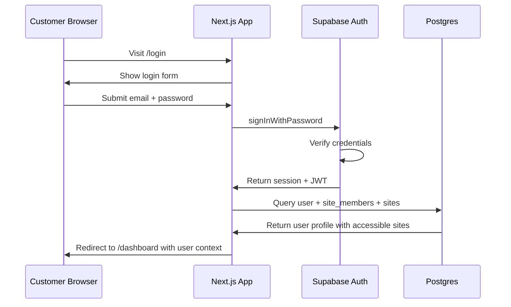
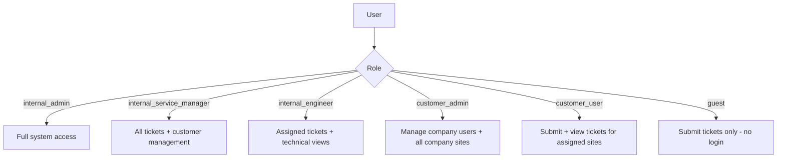
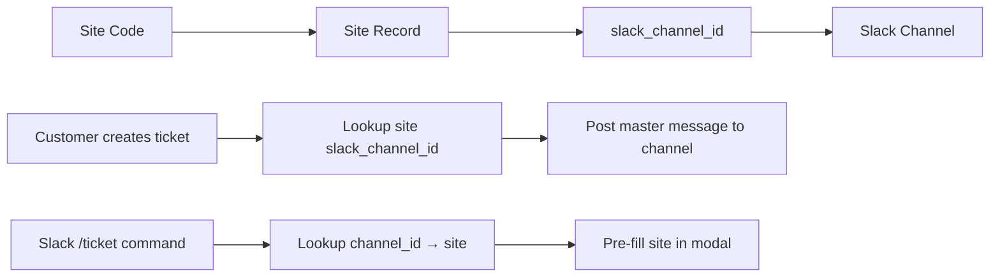

# Phase 2: Customer Login, User Management & Site-Slack Integration

## Overview

Add customer authentication, user management, project status tracking, and Slack channel integration to the Ripple support portal.

---

## Architecture Analysis

### Existing Schema (Already Built)

| Table | Purpose | Key Fields |
|-------|---------|------------|
| `customers` | Customer organizations | name, domain, status |
| `sites` | Customer locations | site_name, site_code, slack_channel_id, customer_id |
| `users` | All users (internal + customer) | email, full_name, role, slack_user_id |
| `site_members` | User ↔ Site junction | site_id, user_id, role |
| `slack_channels` | Site ↔ Slack channel mapping | site_id, channel_id, channel_name |

### What Needs to Change

1. **Add `project_status` to `sites`** — track service contract status
2. **Add Supabase Auth integration** — link `auth.users` → `public.users`
3. **Add customer self-service pages** — login, profile, site management
4. **Add admin user management** — CRUD for customer accounts + site access
5. **Add Slack channel management UI** — link site codes to Slack channels

---

## Data Model Changes

### 1. Sites Table — Add `project_status`

```sql
ALTER TABLE sites ADD COLUMN project_status TEXT NOT NULL DEFAULT 'pre_signoff'
  CHECK (project_status IN (
    'pre_signoff',       -- 未交付
    'in_warranty',       -- 质保
    'full_coverage',     -- 年度全保
    'essential_coverage', -- 年度基保
    'out_of_service'     -- 无服务
  ));
```

### 2. Supabase Auth Integration

Create a trigger that auto-creates a `public.users` row when a new user signs up via Supabase Auth:

```sql
-- auth.users → public.users sync trigger
CREATE OR REPLACE FUNCTION handle_new_user()
RETURNS TRIGGER AS $$
BEGIN
  INSERT INTO public.users (id, email, full_name, role, status)
  VALUES (
    NEW.id,
    NEW.email,
    COALESCE(NEW.raw_user_meta_data->>'full_name', NEW.email),
    COALESCE(NEW.raw_user_meta_data->>'role', 'guest'),
    'active'
  );
  RETURN NEW;
END;
$$ LANGUAGE plpgsql SECURITY DEFINER;

CREATE TRIGGER on_auth_user_created
  AFTER INSERT ON auth.users
  FOR EACH ROW EXECUTE FUNCTION handle_new_user();
```

### 3. User ↔ Site Access Flow

Already supported by `site_members` table. A customer user can be linked to multiple sites:

```
User (customer_user) ──┬── site_members ─── Site A (ADI-INDY-001)
                       ├── site_members ─── Site B (ADI-CHI-002)
                       └── site_members ─── Site C (XYZ-DET-001)
```

### 4. Site ↔ Slack Channel Mapping

Already supported. Each site has:
- `sites.slack_channel_id` — direct reference
- `slack_channels` table — detailed mapping with channel type

---

## Authentication Flow



### Auth Pages

| Route | Description |
|-------|-------------|
| `/login` | Email/password login form |
| `/signup` | Customer self-registration (invite-only or open) |
| `/auth/callback` | Supabase Auth OAuth callback handler |
| `/auth/confirm` | Email confirmation handler |

### Session Management

- Use `@supabase/ssr` package (already installed)
- Server-side session via cookies
- Middleware protects `/dashboard`, `/tickets`, `/customers`, `/settings` routes
- Customer users can only see their own sites and tickets

---

## User Roles & Permissions



### RLS Policies

```sql
-- Customers can only see their own sites
CREATE POLICY "Customers see own sites" ON sites
  FOR SELECT USING (
    EXISTS (
      SELECT 1 FROM site_members sm
      JOIN users u ON sm.user_id = u.id
      WHERE sm.site_id = sites.id
      AND u.id = auth.uid()
    )
  );

-- Customers can only see tickets for their sites
CREATE POLICY "Customers see own tickets" ON tickets
  FOR SELECT USING (
    EXISTS (
      SELECT 1 FROM site_members sm
      JOIN users u ON sm.user_id = u.id
      WHERE sm.site_id = tickets.site_id
      AND u.id = auth.uid()
    )
  );
```

---

## Page Structure

### Customer Portal (after login)

| Route | Page | Description |
|-------|------|-------------|
| `/dashboard` | Customer Dashboard | Overview of their sites and recent tickets |
| `/tickets` | Ticket List | Filtered to their sites only |
| `/tickets/[id]` | Ticket Detail | Full ticket view with comments |
| `/sites` | My Sites | List of accessible sites with project status |
| `/profile` | Profile Settings | Name, email, phone management |

### Admin Portal (internal users)

| Route | Page | Description |
|-------|------|-------------|
| `/admin/users` | User Management | CRUD for all users, assign sites |
| `/admin/users/[id]` | User Detail | Edit user, manage site access |
| `/admin/customers` | Customer Management | CRUD for customer orgs |
| `/admin/sites` | Site Management | CRUD for sites, project status, Slack channel |
| `/admin/sites/[id]` | Site Detail | Edit site, link Slack channel, manage members |

---

## Site ↔ Slack Channel Integration

### Mapping Flow



### How It Works

1. **Admin creates a Site** in the web portal with a `site_code` (e.g., `ADI-INDY-001`)
2. **Admin links Slack channel** by selecting from a dropdown (fetched via Slack API `conversations.list`) or manually entering channel ID
3. **When a ticket is created via web**: system looks up the site's `slack_channel_id` and posts the master ticket message there
4. **When `/ticket` is used in Slack**: system looks up which site the current channel belongs to and pre-fills the site info
5. **When a customer submits via web portal**: the ticket is routed to the correct Slack channel based on the selected site code

### Admin UI for Slack Linking

In the Site management page:
- Show current linked channel (if any)
- Button to "Link Slack Channel" → fetches available channels from Slack API
- Dropdown to select channel
- Save mapping to `sites.slack_channel_id` and `slack_channels` table

---

## Implementation Plan

### Step 1: Database Migration
- [ ] Add `project_status` column to `sites` table
- [ ] Create `handle_new_user()` trigger for Supabase Auth sync
- [ ] Update RLS policies for customer-scoped access
- [ ] Add `auth.uid()` based policies

### Step 2: Auth Infrastructure
- [ ] Update `src/lib/supabase/server.ts` for proper cookie-based auth
- [ ] Create `/auth/callback` route handler
- [ ] Create `/auth/confirm` route handler
- [ ] Update middleware to check Supabase Auth session

### Step 3: Login/Signup Pages
- [ ] Create `/login` page with email/password form
- [ ] Create `/signup` page (admin-invite or open registration)
- [ ] Add password reset flow
- [ ] Style with Ripple branding

### Step 4: Customer Portal
- [ ] Update `/dashboard` to show customer-specific data
- [ ] Update `/tickets` to filter by user's accessible sites
- [ ] Create `/sites` page showing accessible sites with project status
- [ ] Create `/profile` page for account settings

### Step 5: Admin User Management
- [ ] Create `/admin/users` page with user list
- [ ] Create `/admin/users/[id]` page for editing users + site access
- [ ] Add site member add/remove functionality
- [ ] Add invite user flow (sends email with signup link)

### Step 6: Site Management with Slack Integration
- [ ] Update site management to include `project_status`
- [ ] Add Slack channel linking UI
- [ ] Create API endpoint to fetch available Slack channels
- [ ] Add site code display and management

### Step 7: Update Ticket Flow
- [ ] Update ticket creation to route to correct Slack channel
- [ ] Add site selector for customers (filtered to their sites)
- [ ] Update Slack `/ticket` to auto-detect site from channel

### Step 8: Update Types & API
- [ ] Update `src/types/ticket.ts` with new types
- [ ] Update API routes to enforce customer-scoped access
- [ ] Add user management API endpoints
- [ ] Add Slack channel management API endpoints
