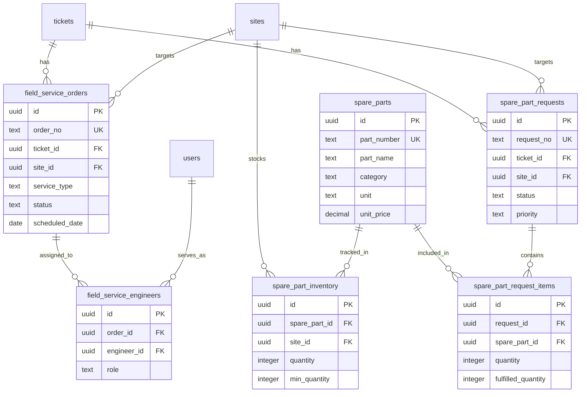
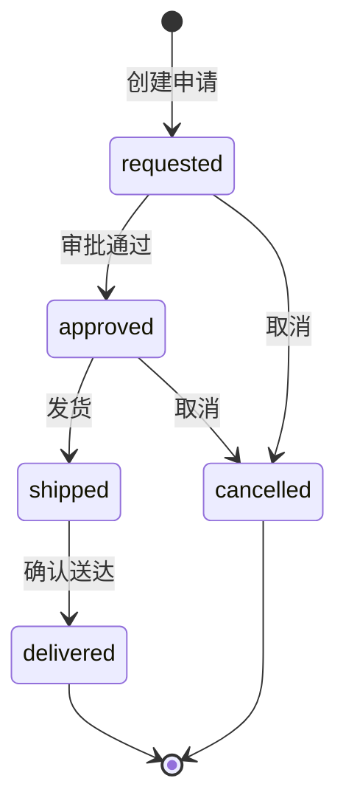
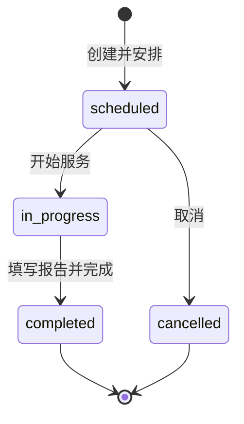

# Phase 3: 备件管理 + 现场派工服务系统

## 概述

在现有工单系统基础上，新增两个核心模块：
1. **备件管理** — 备件目录、库存管理、备件申请单
2. **现场派工** — 现场服务单、工程师调度、服务报告

每个工单可以选择性关联一个或多个备件申请单、一个或多个现场服务单。

---

## 1. 数据库设计

### 1.1 备件目录 `spare_parts`

全局备件主数据，所有站点共用。

| 字段 | 类型 | 说明 |
|------|------|------|
| id | UUID PK | 主键 |
| part_number | TEXT NOT NULL UNIQUE | 备件编号，如 SEN-001 |
| part_name | TEXT NOT NULL | 备件名称 |
| description | TEXT | 详细描述 |
| category | TEXT | 分类：sensor, motor, controller, belt, roller, cable, other |
| unit | TEXT DEFAULT piece | 单位：piece, set, meter, kg |
| unit_price | DECIMAL(10,2) | 单价（USD） |
| compatible_models | TEXT[] | 兼容设备型号 |
| image_url | TEXT | 备件图片 |
| is_active | BOOLEAN DEFAULT true | 是否启用 |
| created_at | TIMESTAMPTZ | 创建时间 |
| updated_at | TIMESTAMPTZ | 更新时间 |

### 1.2 备件库存 `spare_part_inventory`

按站点跟踪库存。

| 字段 | 类型 | 说明 |
|------|------|------|
| id | UUID PK | 主键 |
| spare_part_id | UUID FK → spare_parts | 备件 |
| site_id | UUID FK → sites | 站点 |
| quantity | INTEGER DEFAULT 0 | 当前库存 |
| min_quantity | INTEGER DEFAULT 0 | 最低库存警戒线 |
| max_quantity | INTEGER | 最高库存 |
| location | TEXT | 存放位置描述 |
| last_restocked_at | TIMESTAMPTZ | 最后补货时间 |
| created_at | TIMESTAMPTZ | 创建时间 |
| updated_at | TIMESTAMPTZ | 更新时间 |

UNIQUE 约束：`spare_part_id + site_id`

### 1.3 备件申请单 `spare_part_requests`

关联到工单的备件申请。

| 字段 | 类型 | 说明 |
|------|------|------|
| id | UUID PK | 主键 |
| request_no | TEXT NOT NULL UNIQUE | 申请单号，如 SPR-0001 |
| ticket_id | UUID FK → tickets | 关联工单（可选） |
| site_id | UUID FK → sites | 目标站点 |
| status | TEXT | requested / approved / shipped / delivered / cancelled |
| priority | TEXT | low / normal / high / urgent |
| notes | TEXT | 备注 |
| requested_by | UUID FK → users | 申请人 |
| approved_by | UUID FK → users | 审批人 |
| shipped_at | TIMESTAMPTZ | 发货时间 |
| delivered_at | TIMESTAMPTZ | 送达时间 |
| shipping_carrier | TEXT | 物流公司 |
| shipping_tracking | TEXT | 物流追踪号 |
| total_cost | DECIMAL(10,2) | 总费用 |
| created_at | TIMESTAMPTZ | 创建时间 |
| updated_at | TIMESTAMPTZ | 更新时间 |

### 1.4 备件申请明细 `spare_part_request_items`

每个申请单包含的备件明细。

| 字段 | 类型 | 说明 |
|------|------|------|
| id | UUID PK | 主键 |
| request_id | UUID FK → spare_part_requests | 申请单 |
| spare_part_id | UUID FK → spare_parts | 备件 |
| quantity | INTEGER NOT NULL | 申请数量 |
| fulfilled_quantity | INTEGER DEFAULT 0 | 实际发货数量 |
| unit_price | DECIMAL(10,2) | 单价（快照） |
| notes | TEXT | 备注 |
| created_at | TIMESTAMPTZ | 创建时间 |

### 1.5 现场服务单 `field_service_orders`

关联到工单的现场派工。

| 字段 | 类型 | 说明 |
|------|------|------|
| id | UUID PK | 主键 |
| order_no | TEXT NOT NULL UNIQUE | 服务单号，如 FSO-0001 |
| ticket_id | UUID FK → tickets | 关联工单（可选） |
| site_id | UUID FK → sites | 目标站点 |
| service_type | TEXT | repair / installation / inspection / commissioning / training / emergency |
| status | TEXT | scheduled / in_progress / completed / cancelled |
| priority | TEXT | low / normal / high / urgent |
| title | TEXT | 服务标题 |
| description | TEXT | 服务描述 |
| scheduled_date | DATE | 计划开始日期 |
| scheduled_end_date | DATE | 计划结束日期 |
| estimated_hours | DECIMAL(5,1) | 预估工时 |
| actual_hours | DECIMAL(5,1) | 实际工时 |
| travel_required | BOOLEAN DEFAULT true | 是否需要差旅 |
| travel_from | TEXT | 出发地 |
| completion_report | TEXT | 完成报告 |
| completion_notes | TEXT | 完成备注 |
| requested_by | UUID FK → users | 请求人 |
| completed_by | UUID FK → users | 完成人 |
| completed_at | TIMESTAMPTZ | 完成时间 |
| created_at | TIMESTAMPTZ | 创建时间 |
| updated_at | TIMESTAMPTZ | 更新时间 |

### 1.6 现场服务工程师 `field_service_engineers`

多对多关联：一个服务单可以分配多个工程师。

| 字段 | 类型 | 说明 |
|------|------|------|
| id | UUID PK | 主键 |
| order_id | UUID FK → field_service_orders | 服务单 |
| engineer_id | UUID FK → users | 工程师 |
| role | TEXT | lead / engineer / assistant |
| assigned_at | TIMESTAMPTZ | 分配时间 |

UNIQUE 约束：`order_id + engineer_id`

---

## 2. 实体关系图



---

## 3. 权限设计

| 操作 | internal_admin | internal_service_manager | internal_engineer | customer_user |
|------|:-:|:-:|:-:|:-:|
| 管理备件目录 | ✅ | ❌ | ❌ | ❌ |
| 查看库存 | ✅ | ✅ | ✅ | 只看本站 |
| 创建备件申请 | ✅ | ✅ | ✅ | ❌ |
| 审批备件申请 | ✅ | ✅ | ❌ | ❌ |
| 创建现场服务单 | ✅ | ✅ | ✅ | ❌ |
| 分配工程师 | ✅ | ✅ | ❌ | ❌ |
| 查看服务单 | ✅ | ✅ | ✅ | 只看本站 |
| 填写完成报告 | ✅ | ✅ | ✅ | ❌ |

---

## 4. API 路由设计

### 4.1 备件目录（Admin Only）

```
GET    /api/admin/spare-parts              — 列表（支持搜索、分类过滤）
POST   /api/admin/spare-parts              — 创建备件
GET    /api/admin/spare-parts/[id]         — 详情
PATCH  /api/admin/spare-parts/[id]         — 更新
DELETE /api/admin/spare-parts/[id]         — 停用（soft delete）
```

### 4.2 备件库存

```
GET    /api/spare-part-inventory           — 库存列表（支持 site_id 过滤）
POST   /api/admin/spare-part-inventory     — 添加库存记录
PATCH  /api/admin/spare-part-inventory/[id] — 更新库存数量
```

### 4.3 备件申请单

```
GET    /api/spare-part-requests            — 列表（内部看全部，客户看本站）
POST   /api/spare-part-requests            — 创建申请
GET    /api/spare-part-requests/[id]       — 详情
PATCH  /api/spare-part-requests/[id]       — 更新状态/审批
```

### 4.4 现场服务单

```
GET    /api/field-service-orders           — 列表（内部看全部，客户看本站）
POST   /api/field-service-orders           — 创建服务单
GET    /api/field-service-orders/[id]      — 详情
PATCH  /api/field-service-orders/[id]      — 更新状态/分配/完成
```

### 4.5 工单关联查询

```
GET    /api/tickets/[ticketId]/spare-part-requests   — 工单关联的备件申请
GET    /api/tickets/[ticketId]/field-service-orders   — 工单关联的现场服务单
```

---

## 5. 前端页面设计

### 5.1 Admin 区域（侧边栏新增）

```
Admin
├── Customers & Sites    (已有)
├── Users                (已有)
├── Spare Parts          (新增)
│   ├── /admin/spare-parts              — 备件目录列表
│   ├── /admin/spare-parts/create       — 新增备件
│   └── /admin/spare-parts/[id]         — 编辑备件
├── Inventory            (新增)
│   └── /admin/inventory                — 库存管理（按站点查看）
├── Part Requests        (新增)
│   ├── /admin/part-requests            — 备件申请列表
│   └── /admin/part-requests/[id]       — 申请详情/审批
└── Field Service        (新增)
    ├── /admin/field-service            — 现场服务单列表
    └── /admin/field-service/[id]       — 服务单详情/调度
```

### 5.2 工单详情页增强

在 `/tickets/[ticketId]` 页面新增两个关联区域：

1. **备件申请** 区域
   - 显示已关联的备件申请单列表
   - 按钮：+ New Part Request（弹出 Modal）
   - 每个申请单显示：编号、状态、备件数量、总费用

2. **现场服务** 区域
   - 显示已关联的现场服务单列表
   - 按钮：+ New Field Service Order（弹出 Modal）
   - 每个服务单显示：编号、类型、状态、计划日期、工程师

### 5.3 内部工程师视图

内部工程师登录后可以看到：
- 被分配的现场服务单（My Assignments）
- 待处理的备件申请

---

## 6. 状态流转

### 6.1 备件申请单状态



### 6.2 现场服务单状态



---

## 7. 自动编号规则

| 单据 | 前缀 | 格式 | 示例 |
|------|------|------|------|
| 备件申请单 | SPR | SPR-XXXX | SPR-0001 |
| 现场服务单 | FSO | FSO-XXXX | FSO-0001 |

使用 PostgreSQL sequence 或触发器自动生成，与 ticket_no 机制一致。

---

## 8. 实施步骤

### Step 1: 数据库 Migration
- `016_create_spare_parts.sql` — 创建上述 6 张表
- 添加索引、RLS 策略、自动编号函数

### Step 2: TypeScript 类型
- 在 `src/types/ticket.ts` 中新增类型定义

### Step 3: API 路由
- 备件目录 CRUD（Admin Only）
- 库存管理
- 备件申请单 CRUD
- 现场服务单 CRUD
- 工单关联查询

### Step 4: 前端页面
- Admin 备件目录管理页
- Admin 库存管理页
- 备件申请列表 + 详情页
- 现场服务单列表 + 详情页
- 工单详情页关联区域

### Step 5: 侧边栏 + 导航
- 更新 layout.tsx 添加新菜单项

### Step 6: Build 验证 + 测试
